Eu sou Arthur Felipe, desenvolvedor web em formação e apaixonado por programação.  
Meu primeiro contato com esse mundo foi no ensino médio ao fazer um curso técnico e desde então não largo mais os estudos na área.  
Gosto muito de desenvolvimento backend e procuro crescer cada vez mais nesse vasto mundo.
 

## Stats 🔢🎲

  

    
    
  

## Linguagens e Tecnologias 💻🌐
&nbsp;
&nbsp;
&nbsp;
&nbsp;
&nbsp;
&nbsp;
&nbsp;
&nbsp;

## Contatos 📱☎️

  <a href="https://www.linkedin.com/in/arthurfaraujo"></img></a>
  <a href="https://www.instagram.com/arthurfaraujoo/"></img></a>
  <a href="mailto:arthurfelipe5567@gmail.com"></img></a>

 

